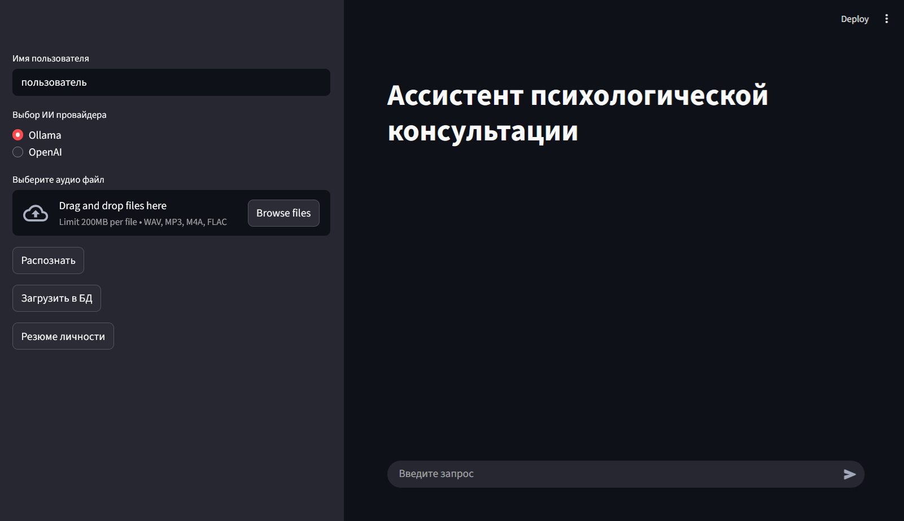

# Ассистент психологической консультации и анализа личности на основе RAG
Данное приложение позволяет анализиовать психотерапевтические сессии посредством диалогового бота

## :rocket: Воркфлоу

- Выбор ИИ провайдера
- Загрузка аудио файлов содержащих записи сессий психологических консультаций, саморефлексии
- Распознавание аудио при помощи локальной модели Whisper
- Обработка данных и добавление в векторную базу знаний
- Суммаризация данных и формирование резюме по всем сессиям
- Обработка вопросов пользователя на основе контекста из обобщенного резюме и релевантных фрагментов 

## :hammer_and_wrench: Использованные технологии

- Retrieval Augumented Generation
- LangChain
- ChromaDB
- Faster Whisper
- Ollama
- OpenAI API
- Streamlit

## :computer: Интерфейс

